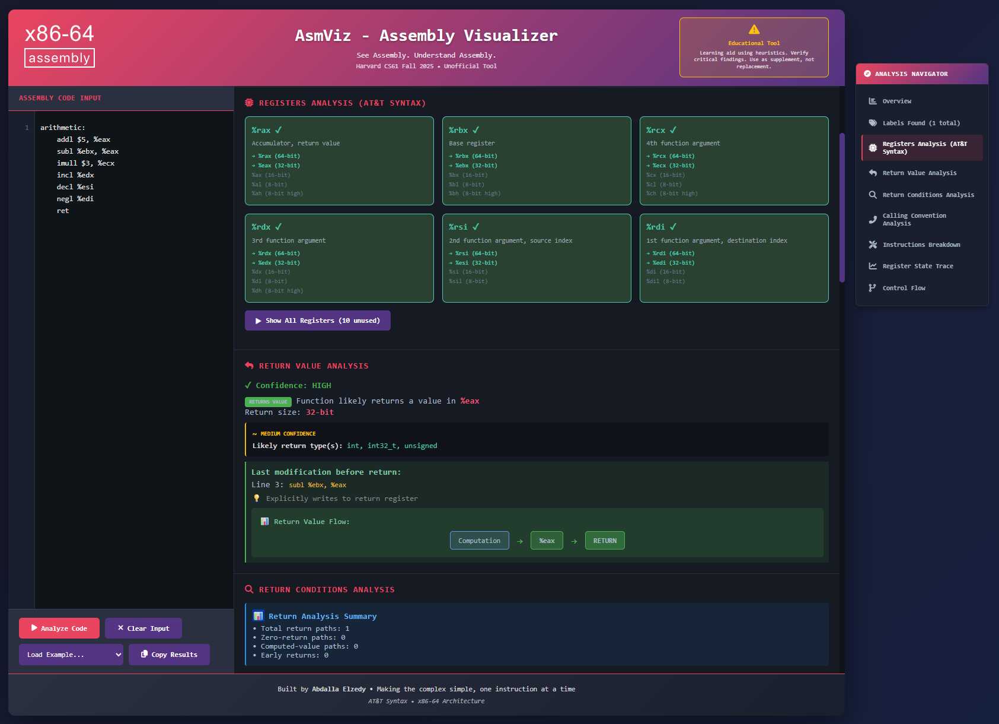
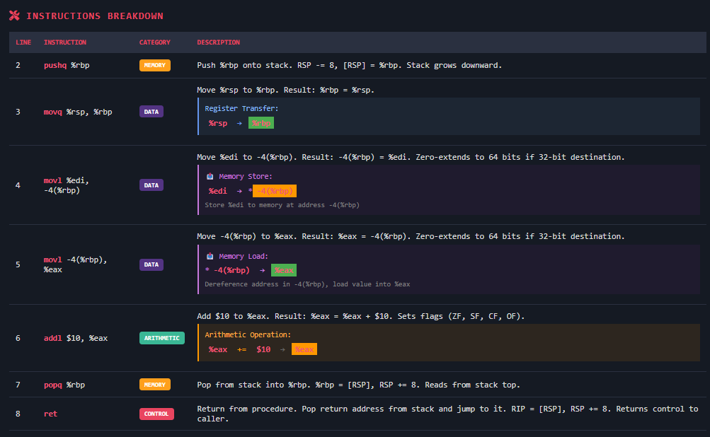

# AsmViz

AsmViz is a small, browser-based tool for exploring and understanding **x86-64 assembly code**.

It was built as a learning companion, not a simulator, debugger, or assembler, with the goal of making low-level code easier to see, follow, and understand.

The idea for this project grew out of **CS61 (Systems Programming and Machine Organization)** at **Harvard University**, a course that focuses on how software interacts with hardware, including memory layout, calling conventions, and assembly programming. Spending time with assembly during the course made it clear how helpful a gentle visual aid could be.

Live demo:  
https://abdallaelzedy.github.io/AsmViz/

---

## Why AsmViz Exists

Assembly is precise and powerful, but it is often difficult to read, especially when you are still building intuition.

During CS61, much of the challenge was not writing assembly, but understanding what it was doing:
- how stack frames form and unwind,
- how control flow emerges from jumps and labels,
- how common instruction patterns appear again and again.

AsmViz was created to slow things down and make those ideas more visible.

---

## What This Tool Is and Is Not

**AsmViz is:**
- A visualization and analysis aid for x86-64 assembly
- Focused on conceptual understanding
- Designed for learning, review, and exploration
- Fully client-side and easy to try

**AsmViz is not:**
- A full assembler
- A CPU emulator
- A debugger
- A replacement for professional systems tools

The emphasis is on clarity rather than completeness.

---

## What You Can Do With It

- Inspect individual x86-64 instructions
- See how functions shape the stack
- Follow loops, jumps, and calls
- Recognize common instruction patterns
- Explore example snippets without setup

Everything runs directly in the browser.

---

## How to Use

1. Open the live site  
   https://abdallaelzedy.github.io/AsmViz/

2. Paste or write x86-64 assembly code using AT&T syntax

3. Click **Analyze Code**

4. Explore the results:
   - Instruction breakdowns
   - Stack-related structure
   - Control flow relationships

A few built-in examples are included if you want to start by exploring rather than writing.

---

## Design Notes

- The analysis is heuristic-based and intentionally conservative
- The tool avoids guessing when information is unclear
- The output is meant to support learning, not simulate execution

AsmViz works best alongside lectures, textbooks, and traditional tools such as `gdb` or `objdump`.

---

## Limitations

- x86-64 only
- AT&T syntax
- No real execution or register emulation
- Best suited for small to medium snippets

For deep debugging or performance work, dedicated systems tools are still essential.

---

## Looking Ahead

Possible directions this project could grow into include:

- Support for Intel syntax
- Clearer data-flow visualization
- Improved representations of calling conventions
- Exportable views for teaching material

These are ideas rather than promises, and the project remains guided by learning needs.

---

## Acknowledgments

This project was inspired by **CS61 at Harvard University**, whose focus on systems programming and machine organization highlights both the challenge and the elegance of working close to the hardware.

---

## Author

Built by **Abdalla Elzedy**  
as a personal learning project and a small contribution toward making systems programming more approachable.

---

## License

MIT License
